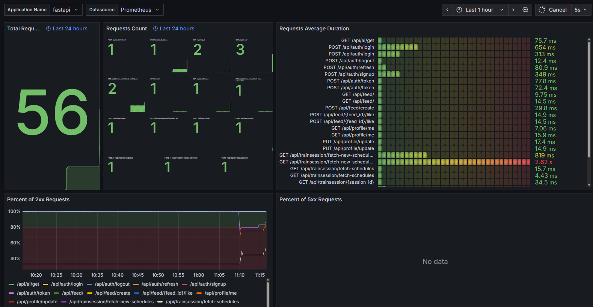

# 🏃 Personal Running Coach

- https://coach4runners.me
- 사용자의 러닝 기록과 목표를 기반으로 **맞춤형 훈련 스케줄**과 **AI 코칭 피드백**을 제공하는 웹 서비스 
- 백엔드 중심 아키텍처로 설계되었으며, 프론트엔드는 기본 기능 확인용 UI 제공.  

---

## 📍 프로젝트 목적
러닝 데이터를 단순히 기록하는 수준을 넘어서,  
**개인의 훈련 데이터를 기반으로 사용자에 맞는 주간 훈련 계획을 자동 생성·보정해주는 시스템**을 구축하는 것을 목표로 함.

- 러너가 자신의 훈련 데이터를 쉽게 기록하고 분석할 수 있도록 함  
- LLM 기반으로 맞춤형 훈련 피드백과 계획을 생성  
- 실 서비스 수준의 백엔드 설계 및 배포 (로드밸런싱, 모니터링, 무중단 배포 포함)
- 개인화된 러닝 코칭 플랫폼으로의 확장 가능성 검증

---


## 🏗️ 프로젝트 아키텍처
```
[Client(Browser)]
        ↓
[Frontend(React, Vite)] 
        ↓
[Nginx + Certbot(SSL, Reverse Proxy, Static Serving)]
        ↓
[Backend (FastAPI app1,app2)] → [DB(PostgreSQL)]
                            ↘ [Redis]
                            ↘ [LLM(OpenAI)]
                            ↘ [Prometheus/Grafana]
```  
- **Nginx** → 정적 파일 제공, 백엔드 리버스 프록시,  로드밸런싱
- **Certbot** → SSL 인증서 자동 발급/갱신
- **Docker** → 컨테이너 기반 배포
- **Backend**: FastAPI (포트 & 아답터 아키텍처)
- **Frontend**: React(Vite) / 기본 구현
- **Database**: PostgreSQL (+ Alembic 마이그레이션)
- **Cache 관리**: Redis
- **LLM**: OpenAI API

### 백엔드 포트&아답터 아키텍쳐


---

## 📌 주요 기능
- 사용자 프로필 관리 (회원가입 / 로그인 / 구글 OAuth)
- 서드 파티 훈련 데이터 사용 (스트라바 OAuth)
- 훈련 기록 업로드 및 저장
- AI 기반 맞춤형 훈련 스케줄 및 코치 조언 생성 (LLM)
- 기본 피드 기능 제공
---


## 🛠️ 기술 스택
- **Backend** : Python, FastAPI
  - 로드밸런싱 : 백엔드 2개 인스턴스 운영, Nginx 기반 리버스 프록시
  - 무중단 배포 : Docker + GitHub Actions + Nginx Blue/Green 전략
- **Frontend** : React, Vite
- **Database** : PostgreSQL
  - 버전 관리/마이그레이션 : Alembic
- **Cache** : Redis (세션 + etag 관리)
- **Infra & Deployment** : Docker, Nginx, Certbot(SSL), GitHub Actions(CI/CD),
                        Prometheus, Grafana
- **LLM** : OpenAI API

---

## ⚙️ 설치 및 실행 방법
```
// 프론트 파일 빌드
cd frontend
npm run build

```
```
// 도커 실행
docker compose -f 'docker-compose.dev.yml' up --build -d
```


##### 환경 변수 설정
- `backend/src/.env` : env.example 확인
- `monitoring/.env` : env.example 확인
- `frontend/.env` : env.example 확인

---

## 📊 모니터링
- **Prometheus**: 애플리케이션/서버 메트릭 수집
- **Grafana**: 시각화 및 대시보드 제공
- **연동**: FastAPI → Prometheus metrics endpoint(`/metrics`) → Grafana 대시보드
- **Endpoint**: [https://coach4runners.me/monitoring](https://coach4runners.me/monitoring)



---
## 🚀 TODO / 개선 예정
- [ ] 프론트엔드 UI 개선 (대시보드/훈련 결과 시각화)
- [ ] 훈련 스케줄 추천 프롬프트 고도화 (AI 코칭 정확도 향상)
- [ ] 서드파티 추가 연동 (가민/코로스 등)
- [ ] 프론트엔드 배포 분리: S3, Lambda, Cloudfront 활용
- [ ] 사용자 등급에 따른 LLM 호출 빈도 설정
---

## 📄 라이선스
MIT License
